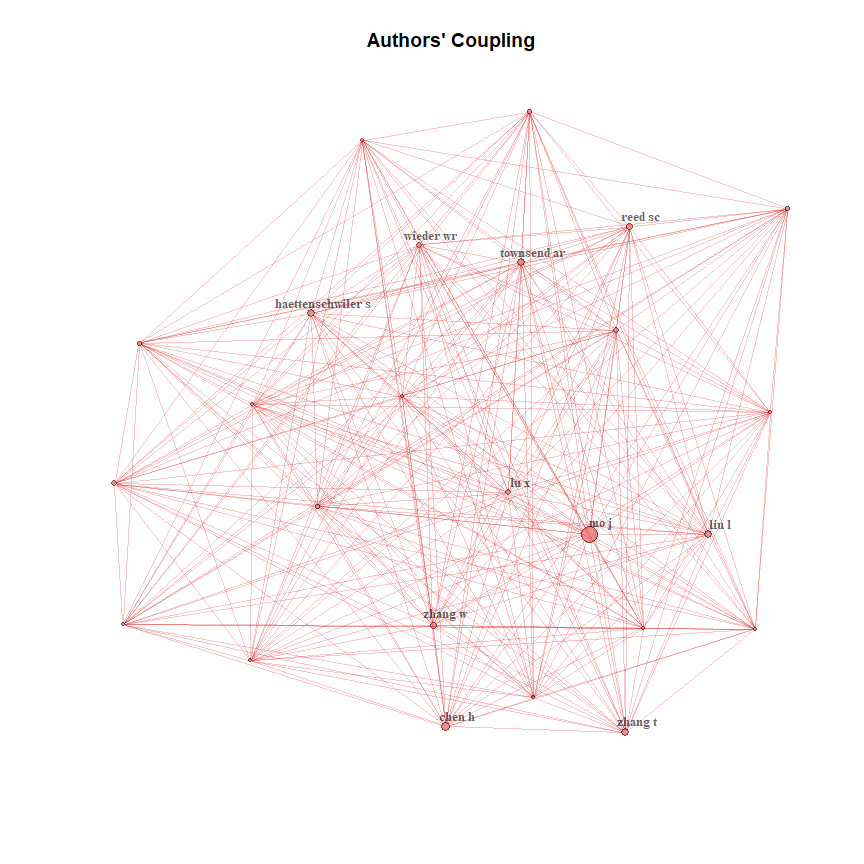
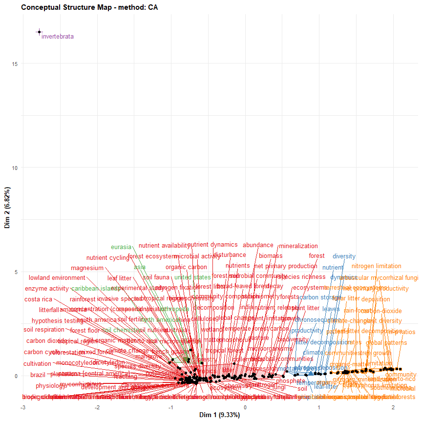
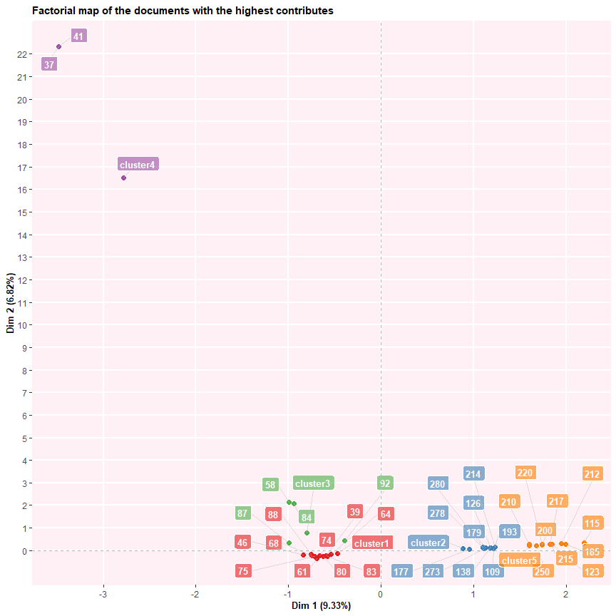
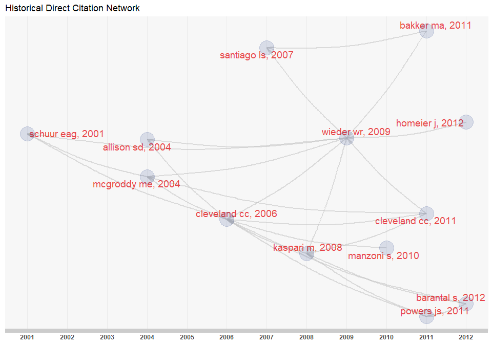

In this tutorial, I will show you how to conduct a simple bibliometric analysis 
using the r package `bibliometrix`. In addition following packages will be used


```r
library(bibliometrix)
```

```
## Warning: package 'bibliometrix' was built under R version 4.0.2
```

```
## To cite bibliometrix in publications, please use:
## 
## Aria, M. & Cuccurullo, C. (2017) bibliometrix: An R-tool for comprehensive science mapping analysis, Journal of Informetrics, 11(4), pp 959-975, Elsevier.
##                         
## 
## http:\\www.bibliometrix.org
## 
##                         
## To start with the shiny web-interface, please digit:
## biblioshiny()
```

```r
library(dplyr)
```

```
## 
## Attaching package: 'dplyr'
```

```
## The following objects are masked from 'package:stats':
## 
##     filter, lag
```

```
## The following objects are masked from 'package:base':
## 
##     intersect, setdiff, setequal, union
```


# Getting and processing the data

For this, I will be using the following database

* [Scopus](https://www.scopus.com/search/form.uri?display=basic) 
* [Web of Science](http://apps.webofknowledge.com/WOS_GeneralSearch_input.do?product=WOS&search_mode=GeneralSearch&SID=D5dxuHZlVBDgtmQLXzT&preferencesSaved=) 

Firstly, I will export the results in `BibTex` format from the database by searching
the following search query

* **phosphorus AND "Litter decomposition" AND tropical**

For scopus, the keywords were searched in *Document search* by specifying the field
option as *Article title, Abstract, Keywords*. This resulted in total of 102 documents.
Then all documents were exported in `BibTex` format by selecting all the fields.
Then the data is converted into a dataframe using the function `convert2df()`.


```r
file_scopus <- "D:/R_tutorials/bibliometrics/scopus.bib"
M_scopus <- convert2df(file = file_scopus, dbsource = "scopus", format = "bibtex")
```

```
## 
## Converting your scopus collection into a bibliographic dataframe
## 
## Done!
## 
## 
## Generating affiliation field tag AU_UN from C1:  Done!
```

Similarlt, the query was made to the *Web of Science Core Collection* database in 
*Basic search* by specifying option as *Topic* and time span *1989-2020*. This 
resulted in total 198 documents. All the documents were selected by selecting all 
the pages and then added to the *Marked List*. Then *All records in this list (up to 500)* 
option is checked out. Then from Select Conten *Select All* Option is checked. Then 
Then exported in `BibTex` format using the *Export to Other File Formats* Option.


```r
library(bibliometrix)
file_wos <- "D:/R_tutorials/bibliometrics/wos.bib"
M_wos <- convert2df(file = file_wos, dbsource = "isi", format = "bibtex")
```

```
## 
## Converting your isi collection into a bibliographic dataframe
## 
## Done!
## 
## 
## Generating affiliation field tag AU_UN from C1:  Done!
```

After, creating the dataframes, I have joined both the data frames and then removed 
the rows with duplicated title to create a new data frame M1. So, this is the data
for 232 uniques article that we will use for our study.


```r
M1 <- full_join(M_scopus, M_wos)
```

```
## Joining, by = c("AU", "DE", "ID", "C1", "CR", "JI", "AB", "AR", "RP", "DT", "DI", "FU", "SN", "SO", "LA", "TC", "PN", "PP", "PU", "DB", "TI", "VL", "PY", "FX", "AU_UN", "AU1_UN", "AU_UN_NR", "SR_FULL", "SR")
```

```r
M <- M1[!duplicated(M1$TI), ]
```

Each manuscript contains several elements, such as authors' names, title, keywords 
and other information. All these elements constitute the bibliographic attributes 
of a document, also called metadata.

Data frame columns are named using the standard Clarivate Analytics WoS Field Tag codify. 

The main field tags are:

Field Tag  | Description
---------- | -----------
AU		     | Authors
TI		     | Document Title
SO		     | Publication Name (or Source)
JI		     | ISO Source Abbreviation
DT		     | Document Type
DE		     | Authors' Keywords
ID		     | Keywords associated by SCOPUS or ISI database
AB		     | Abstract
C1		     | Author Address
RP		     | Reprint Address
CR		     | Cited References
TC		     | Times Cited
PY		     | Year
SC		     | Subject Category
UT		     | Unique Article Identifier
DB		     | Bibliographic Database


For a complete list of field tags see [Bibliometrix Field Tags](http://www.bibliometrix.org/documents/Field_Tags_bibliometrix.pdf)

## Bibliometric Analysis

The first step is to perform a descriptive analysis of the bibliographic data frame.

The function *biblioAnalysis* calculates main bibliometric measures using this syntax:
 

```r
results <- biblioAnalysis(M, sep = ";")
```

The function *biblioAnalysis* returns an object of class "bibliometrix".

An object of class "bibliometrix" is a list containing the following components:

List element       | Description
------------------ | --------------------------------------------
Articles		 | the total number of manuscripts
Authors		   | the authors' frequency distribution
AuthorsFrac	 | the authors' frequency distribution (fractionalized)
FirstAuthors | corresponding author of each manuscript
nAUperPaper	 | the number of authors per manuscript
Appearances |  the number of author appearances
nAuthors		 | the number of authors
AuMultiAuthoredArt | the number of authors of multi-authored articles
MostCitedPapers | the list of manuscripts sorted by citations
Years		     | publication year of each manuscript
FirstAffiliation | the affiliation of the corresponding author
Affiliations | the frequency distribution of affiliations (of all co-authors for each paper)
Aff_frac		 | the fractionalized frequency distribution of affiliations (of all co-authors for each paper)
CO		       | the affiliation country of the corresponding author
Countries		 | the affiliation countries' frequency distribution
CountryCollaboration | the intra-country (SCP) and inter-country (MCP) collaboration indices
TotalCitation | 		 the number of times each manuscript has been cited
TCperYear		 | the yearly average number of times each manuscript has been cited
Sources		   | the frequency distribution of sources (journals, books, etc.)
DE		       | the frequency distribution of authors' keywords
ID		       | the frequency distribution of keywords associated to the manuscript by SCOPUS and Thomson Reuters' ISI Web of Knowledge databases

### Functions *summary* and *plot*

To summarize main results of the bibliometric analysis, use the generic function *summary*.
It displays main information about the bibliographic data frame and several tables, such as annual scientific production, top manuscripts per number of citations, most productive authors, most productive countries, total citation per country, most relevant sources (journals) and most relevant keywords.

Main information table describes the collection size in terms of number of documents, number of authors, number of sources, number of keywords, timespan, and average number of citations. 

Furthermore, many different co-authorship indices are shown. In particular, the **Authors per Article index** is calculated as the ratio between the total number of authors and the total number of articles. The **Co-Authors per Articles index** is calculated as the average number of co-authors per article. In this case, the index takes into account the author appearances while for the "authors per article" an author, even if he has published more than one article, is counted only once.
For that reasons,  *Authors per Article index $\le$ Co-authors per Article index*.

The **Collaboration Index** (CI) is calculated as Total Authors of Multi-Authored Articles/Total Multi-Authored Articles (Elango and Rajendran, 2012; Koseoglu, 2016). In other word, the Collaboration Index is a Co-authors per Article index calculated only using the multi-authored article set.

Elango, B., & Rajendran, P. (2012). Authorship trends and collaboration pattern in the marine sciences literature: a scientometric study. International Journal of Information Dissemination and Technology, 2(3), 166.

Koseoglu, M. A. (2016). Mapping the institutional collaboration network of strategic management research: 1980–2014. Scientometrics, 109(1), 203-226.


*summary* accepts two additional arguments. *k* is a formatting value that indicates the number of rows of each table. *pause* is a logical value (TRUE or FALSE) used to allow (or not) pause in screen scrolling.
Choosing k=10 you decide to see the first 10 Authors, the first 10 sources, etc.


```r
options(width=100)
S <- summary(object = results, k = 10, pause = FALSE)
```

```
## 
## 
## MAIN INFORMATION ABOUT DATA
## 
##  Timespan                              1992 : 2020 
##  Sources (Journals, Books, etc)        98 
##  Documents                             232 
##  Average years from publication        7.71 
##  Average citations per documents       35.39 
##  Average citations per year per doc    3.517 
##  References                            11893 
##  
## DOCUMENT TYPES                     
##  article               224 
##  conference paper      3 
##  review                5 
##  
## DOCUMENT CONTENTS
##  Keywords Plus (ID)                    1410 
##  Author's Keywords (DE)                843 
##  
## AUTHORS
##  Authors                               843 
##  Author Appearances                    1072 
##  Authors of single-authored documents  10 
##  Authors of multi-authored documents   833 
##  
## AUTHORS COLLABORATION
##  Single-authored documents             12 
##  Documents per Author                  0.275 
##  Authors per Document                  3.63 
##  Co-Authors per Documents              4.62 
##  Collaboration Index                   3.79 
##  
## 
## Annual Scientific Production
## 
##  Year    Articles
##     1992        1
##     1994        1
##     1995        4
##     1997        3
##     1998        1
##     1999        1
##     2000        3
##     2001        5
##     2002        3
##     2003        2
##     2004        7
##     2005        3
##     2006        5
##     2007       10
##     2008        9
##     2009        8
##     2010        8
##     2011       11
##     2012       15
##     2013       13
##     2014       14
##     2015       15
##     2016       17
##     2017       11
##     2018       26
##     2019       24
##     2020       12
## 
## Annual Percentage Growth Rate 9.280378 
## 
## 
## Most Productive Authors
## 
##    Authors        Articles Authors        Articles Fractionalized
## 1     MO J              15   MO J                            2.48
## 2     CHEN H             8   SANTIAGO LS                     2.33
## 3     TURNER BL          7   HOFSTEDE RGM                    2.00
## 4     ZHANG W            7   TURNER BL                       1.77
## 5     LIU L              6   VITOUSEK PM                     1.67
## 6     ZHANG T            6   SILVER WL                       1.56
## 7     LU X               5   REJMANKOVA E                    1.50
## 8     SILVER WL          5   CHEN H                          1.35
## 9     CAMENZIND T        4   SCHUUR EAG                      1.33
## 10    FU S               4   WARING BG                       1.33
## 
## 
## Top manuscripts per citations
## 
##                               Paper           TC TCperYear
## 1  WARDLE DA, 2004, SCIENCE                  648     38.12
## 2  MANZONI S, 2010, ECOL MONOGR              385     35.00
## 3  KASPARI M, 2008, ECOL LETT                285     21.92
## 4  CONSTANTINIDES M, 1994, SOIL BIOL BIOCHEM 271     10.04
## 5  KITAYAMA K, 2002, J ECOL                  233     12.26
## 6  QUESADA CA, 2010, BIOGEOSCIENCES          232     21.09
## 7  LIU L, 2012, SOIL BIOL BIOCHEM            205     22.78
## 8  DAVIDSON EA, 2004, ECOL APPL              200     11.76
## 9  HTTENSCHWILER S, 2010, J ECOL             187     17.00
## 10 RAICH JW, 1997, ECOLOGY                   174      7.25
## 
## 
## Corresponding Author's Countries
## 
##           Country Articles   Freq SCP MCP MCP_Ratio
## 1  USA                  58 0.2816  51   7    0.1207
## 2  CHINA                46 0.2233  40   6    0.1304
## 3  BRAZIL               16 0.0777  15   1    0.0625
## 4  GERMANY              14 0.0680  13   1    0.0714
## 5  UNITED KINGDOM       10 0.0485   8   2    0.2000
## 6  INDIA                 9 0.0437   8   1    0.1111
## 7  NETHERLANDS           7 0.0340   5   2    0.2857
## 8  CANADA                5 0.0243   5   0    0.0000
## 9  JAPAN                 5 0.0243   4   1    0.2000
## 10 AUSTRALIA             4 0.0194   4   0    0.0000
## 
## 
## SCP: Single Country Publications
## 
## MCP: Multiple Country Publications
## 
## 
## Total Citations per Country
## 
##      Country      Total Citations Average Article Citations
## 1  USA                       3288                      56.7
## 2  CHINA                      998                      21.7
## 3  SWEDEN                     757                     252.3
## 4  UNITED KINGDOM             434                      43.4
## 5  JAPAN                      386                      77.2
## 6  NETHERLANDS                335                      47.9
## 7  FRANCE                     238                      79.3
## 8  CANADA                     225                      45.0
## 9  BRAZIL                     186                      11.6
## 10 GERMANY                    179                      12.8
## 
## 
## Most Relevant Sources
## 
##                   Sources        Articles
## 1  PLANT AND SOIL                      17
## 2  BIOGEOCHEMISTRY                     11
## 3  BIOTROPICA                          11
## 4  SOIL BIOLOGY \\& BIOCHEMISTRY       11
## 5  JOURNAL OF TROPICAL ECOLOGY         10
## 6  FUNCTIONAL ECOLOGY                   9
## 7  PLOS ONE                             8
## 8  ECOSYSTEMS                           7
## 9  FOREST ECOLOGY AND MANAGEMENT        7
## 10 ECOLOGY                              6
## 
## 
## Most Relevant Keywords
## 
##    Author Keywords (DE)      Articles Keywords-Plus (ID)     Articles
## 1       PHOSPHORUS                 49   NITROGEN                  120
## 2       DECOMPOSITION              48   PHOSPHORUS                119
## 3       NITROGEN                   38   DECOMPOSITION              94
## 4       LITTER DECOMPOSITION       33   LITTER DECOMPOSITION       82
## 5       TROPICAL FOREST            25   CARBON                     50
## 6       NUTRIENT CYCLING           17   TROPICAL FOREST            48
## 7       LITTER QUALITY             14   LEAF LITTER                46
## 8       LIGNIN                     12   LITTER                     41
## 9       MICROBIAL BIOMASS          12   SOIL                       40
## 10      NUTRIENT LIMITATION        12   BIOMASS                    34
```

Some basic plots can be drawn using the generic function \code{plot}:


```r
plot(x = results, k = 10, pause = FALSE)
```

<!-- -->

```
## Warning: Use of `xx$Country` is discouraged. Use `Country` instead.
```

```
## Warning: Use of `xx$Freq` is discouraged. Use `Freq` instead.
```

```
## Warning: Use of `xx$Collaboration` is discouraged. Use `Collaboration` instead.
```

<!-- -->

```
## Warning: Use of `Y$Year` is discouraged. Use `Year` instead.
```

```
## Warning: Use of `Y$Freq` is discouraged. Use `Freq` instead.
```

```
## Warning: Use of `Y$Year` is discouraged. Use `Year` instead.
```

```
## Warning: Use of `Y$Freq` is discouraged. Use `Freq` instead.
```

<!-- -->

```
## Warning: Use of `Table2$Year` is discouraged. Use `Year` instead.
```

```
## Warning: Use of `Table2$MeanTCperYear` is discouraged. Use `MeanTCperYear` instead.
```

```
## Warning: Use of `Table2$Year` is discouraged. Use `Year` instead.
```

```
## Warning: Use of `Table2$MeanTCperYear` is discouraged. Use `MeanTCperYear` instead.
```

<!-- -->

```
## Warning: Use of `Table2$Year` is discouraged. Use `Year` instead.
```

```
## Warning: Use of `Table2$MeanTCperArt` is discouraged. Use `MeanTCperArt` instead.
```

```
## Warning: Use of `Table2$Year` is discouraged. Use `Year` instead.
```

```
## Warning: Use of `Table2$MeanTCperArt` is discouraged. Use `MeanTCperArt` instead.
```

<!-- -->

## Analysis of Cited References 
The function *citations* generates the frequency table of the most cited references 
or the most cited first authors (of references).

For each manuscript, cited references are in a single string stored in the column 
"CR" of the data frame. 

For a correct extraction, you need to identify the separator field among different 
references, used by ISI or SCOPUS database. Usually, the default separator is ";" 
or `".  "` (a dot with double space). You may check it by running \code M$CR[1]


```r
M$CR[1]
```

```
## [1] "AERTS, R., CLIMATE, LEAF LITTER CHEMISTRY AND LEAF LITTER DECOMPOSITION IN TERRESTRIAL ECOSYSTEMS: A TRIANGULAR RELATIONSHIP (1997) OIKOS, 79, PP. 439-449; ALEXANDER, M., INTRODUCTION TO SOIL MICROBIOLOGY (1977) SOIL SCI, 125, P. 447. , HTTPS://DOI.ORG/10.1097/00010694-197805000-00012; BATES, D., MCHLER, M., BOLKER, B., WALKER, S., FITTING LINEAR MIXED-EFFECTS MODELS USING LME4 (2015) STAT COMPUT, 67, PP. 133-199; BEBBER, D.P., WATKINSON, S.C., BODDY, L., DARRAH, P.R., SIMULATED NITROGEN DEPOSITION AFFECTS WOOD DECOMPOSITION BY CORD-FORMING FUNGI (2011) OECOLOGIA, 167, PP. 1177-1184; BERG, B., STAAF, H., LEACHING, ACCUMULATION AND RELEASE OF NITROGEN IN DECOMPOSING FOREST LITTER (1981) ECOLOGICAL BULLETINS (SWEDEN); BERG, B., STAAF, H., RELEASE OF NUTRIENTS FROM DECOMPOSING WHITE BIRCH LEAVES AND SCOTS PINE NEEDLE LITTER (1987) PEDOBIOLOGIA, 30, PP. 55-63; BLAIR, J.M., NITROGEN, SULFUR AND PHOSPHORUS DYNAMICS IN DECOMPOSING DECIDUOUS LEAF LITTER IN THE SOUTHERN APPALACHIANS (1988) SOIL BIOL BIOCHEM, 20, PP. 693-701; BLAIR, J.M., NUTRIENT RELEASE FROM DECOMPOSING FOLIAR LITTER OF 3 TREE SPECIES WITH SPECIAL PREFERENCE TO MAGNESIUM AND POTASSIUM DYNAMICS (1988) PLANT SOIL, 110, PP. 49-55; BOOMINATHAN, K., DASS, S.B., RANDALL, T.A., REDDY, C.A., NITROGEN-DEREGULATED-MUTANTS OF PHANEROCHAETE-CHRYSOSPRORIUM-A LIGNIN-DEGRADING BASIDIOMYCETE (1990) ARCH MICROBIOL, 153, PP. 521-527; BOWMAN, W.D., CLEVELAND, C.C., HALADA, L., HRESKO, J., BARON, J.S., NEGATIVE IMPACT OF NITROGEN DEPOSITION ON SOIL BUFFERING CAPACITY (2008) NAT GEOSCI, 1, PP. 767-770; CHAPIN, F.S., MATSON, P.A., MOONEY, H.A., (2002) PRINCIPLES OF TERRESTRIAL ECOSYSTEM ECOLOGY || TERRESTRIAL NUTRIENT CYCLING, , HTTPS://DOI.ORG/10.1007/0-387-21663-4_9, SPRINGER NEW YORK; CHEN, H., DONG, S., LIU, L., MA, C., ZHANG, T., ZHU, X., MO, J., EFFECTS OF EXPERIMENTAL NITROGEN AND PHOSPHORUS ADDITION ON LITTER DECOMPOSITION IN AN OLD-GROWTH TROPICAL FOREST (2013) PLOS ONE, 8; CHEN, Y., NUTRIENT LIMITATION OF WOODY DEBRIS DECOMPOSITION IN A TROPICAL FOREST: CONTRASTING EFFECTS OF N AND P ADDITION (2016) FUNCT ECOL, 30, PP. 295-304; CLEVELAND, C.C., TOWNSEND, A.R., NUTRIENT ADDITIONS TO A TROPICAL RAIN FOREST DRIVE SUBSTANTIAL SOIL CARBON DIOXIDE LOSSES TO THE ATMOSPHERE (2006) PROC NATL ACAD SCI U S A, 103, PP. 10316-10321; CLEVELAND, C.C., REED, S.C., TOWNSEND, A.R., NUTRIENT REGULATION OF ORGANIC MATTER DECOMPOSITION IN A TROPICAL RAIN FOREST (2006) ECOLOGY, 87, PP. 492-503; CROMACK, K., TODD, R.L., MONK, C.D., PATTERNS OF BASIDIOMYCETE NUTRIENT ACCUMULATION IN CONIFER AND DECIDUOUS FOREST LITTER (1975) SOIL BIOL BIOCHEM, 7, PP. 265-268; CRUZADO, C.P., SANDE, B., OMIL, B., ROVIRA, P., MERINO, A., ORGANIC MATTER PROPERTIES IN SOILS AFFORESTED WITH PINUS RADIATA (2013) PLANT SOIL, 374, PP. 381-398; CURRIE, W.S., ABER, J.D., MODELING LEACHING AS A DECOMPOSITION PROCESS IN HUMID MONTANE FORESTS (1997) ECOLOGY, 78, PP. 1844-1860; CUSACK, D.F., SOIL NITROGEN LEVELS ARE LINKED TO DECOMPOSITION ENZYME ACTIVITIES ALONG AN URBAN-REMOTE TROPICAL FOREST GRADIENT (2013) SOIL BIOL BIOCHEM, 57, PP. 192-203; CUSACK, D.F., TORN, M.S., MCDOWELL, W.H., SILVER, W.L., THE RESPONSE OF HETEROTROPHIC ACTIVITY AND CARBON CYCLING TO NITROGEN ADDITIONS AND WARMING IN TWO TROPICAL SOILS (2010) GLOB CHANG BIOL, 16, PP. 2555-2572; EDMONDS, R.L., THOMAS, T.B., DECOMPOSITION AND NUTRIENT RELEASE FROM GREEN NEEDLES OF WESTERN HEMLOCK AND PACIFIC SILVER FIR IN AN OLD-GROWTH TEMPERATE RAIN-FOREST, OLYMPIC NATIONAL-PARK, WASHINGTON CANADIAN (1995) JOURNAL OF FOREST RESEARCH-REVUE CANADIENNE DE RECHERCHE FORESTIERE, 25, PP. 1049-1057; ELSER, J.J., GLOBAL ANALYSIS OF NITROGEN AND PHOSPHORUS LIMITATION OF PRIMARY PRODUCERS IN FRESHWATER, MARINE AND TERRESTRIAL ECOSYSTEMS (2007) ECOL LETT, 10, PP. 1135-1142; FAHEY, T.J., NUTRIENT DYNAMICS OF ABOVE-GROUND DETRITUS IN LODGEPOLE PINE (PINUS-CONTORTA SSP LATIFOLIA) ECOSYSTEMS, SOUTHEASTERN (1983) WYOMING ECOLOGICAL MONOGRAPHS, 53, PP. 51-72; FANG, H., MO, J., PENG, S., LI, Z., WANG, H., CUMULATIVE EFFECTS OF NITROGEN ADDITIONS ON LITTER DECOMPOSITION IN THREE TROPICAL FORESTS IN SOUTHERN CHINA (2007) PLANT SOIL, 297, PP. 233-242; FIELD, C.B., BEHRENFELD, M.J., RANDERSON, J.T., FALKOWSKI, P., PRIMARY PRODUCTION OF THE BIOSPHERE: INTEGRATING TERRESTRIAL AND OCEANIC COMPONENTS (1998) SCIENCE, 281, PP. 237-240; FISK, M.C., FAHEY, T.J., MICROBIAL BIOMASS AND NITROGEN CYCLING RESPONSES TO FERTILIZATION AND LITTER REMOVAL IN YOUNG NORTHERN HARDWOOD FORESTS (2001) BIOGEOCHEMISTRY, 53, PP. 201-223; FOG, K., THE EFFECT OF ADDED NITROGEN ON THE RATE OF DECOMPOSITION OF ORGANIC-MATTER (1988) BIOL REV, 63, PP. 433-462; GARTNER, T.B., CARDON, Z.G., DECOMPOSITION DYNAMICS IN MIXED-SPECIES LEAF LITTER (2004) OIKOS, 104, PP. 230-246; GOERING, H.K., VAN SOEST, P.J., (1970) FORAGE FIBER ANALYSIS (APPARATUS, REAGENT, PROCEDURES AND SOME APPLICATIONS) AGRIC HANDBOOK, NO 379, , ARS-USDA, WASHINGTON, DC; GOSZ, J.R., LIKENS, G.E., BORMANN, F.H., NUTRIENT RELEASE FROM DECOMPOSING LEAF AND BRANCH LITTER IN HUBBARD BROOK FOREST, NEW-HAMPSHIRE (1973) ECOLOGICAL MONOGRAPHS, 43, PP. 173-191. , HTTPS://DOI.ORG/10.2307/1942193; GRACE, J., MALHI, Y., MEIR, P., HIGUCHI, N., 17 - PRODUCTIVITY OF TROPICAL RAIN FORESTS (2001) TERRESTRIAL GLOBAL PRODUCTIVITY, PP. 401-426. , ROY J, SAUGIER B, MOONEY HA, (EDS), ACADEMIC PRESS, SAN DIEGO; HOBBIE, S.E., VITOUSEK, P.M., NUTRIENT LIMITATION OF DECOMPOSITION IN HAWAIIAN FORESTS (2000) ECOLOGY, 81, PP. 1867-1877. , (,),:, -, DOI., HTTPS://DOI.ORG/; HOU, E., LUO, Y., KUANG, Y., CHEN, C., LU, X., JIANG, L., LUO, X., WEN, D., GLOBAL META-ANALYSIS SHOWS PERVASIVE PHOSPHORUS LIMITATION OF ABOVEGROUND PLANT PRODUCTION IN NATURAL TERRESTRIAL ECOSYSTEMS (2020) NAT COMMUN, 11, P. 11; JACOBSON, T.K.B., BUSTAMANTE, M.M.C., LEAF LITTER DECOMPOSITION AND NUTRIENT RELEASE UNDER NITROGEN, PHOSPHORUS AND NITROGEN PLUS PHOSPHORUS ADDITIONS IN A SAVANNA IN CENTRAL BRAZIL. NITROGEN DEPOSITION, CRITICAL LOADS AND BIODIVERSITY, NITROGEN DEPOSITION (2014) CRITICAL LOADS AND BIODIVERSITY EDN, , HTTPS://DOI.ORG/10.1007/978-94-007-7939-6_17, SPRINGER, DORDRECHT; JANSSENS, I.A., REDUCTION OF FOREST SOIL RESPIRATION IN RESPONSE TO NITROGEN DEPOSITION (2010) NAT GEOSCI, 3, PP. 315-322; JOHNSTON, S.R., LYNNE, B., WEIGHTMAN, A.J., BACTERIA IN DECOMPOSING WOOD AND THEIR INTERACTIONS WITH WOOD-DECAY FUNGI (2016) FEMS. MICROB ECOL, 92. , HTTPS://DOI.ORG/10.1093/FEMSEC/FIW179; LASKOWSKI, R., BERG, B., DYNAMICS OF SOME MINERAL NUTRIENTS AND HEAVY-METALS IN DECOMPOSING FOREST LITTER (1993) SCANDINAVIAN JOURNAL OF FOREST RESEARCH, 8, PP. 446-456; LASKOWSKI, R., BERG, B., JOHANSSON, M.B., MCCLAUGHERTY, C., RELEASE PATTERN FOR POTASSIUM FROM DECOMPOSING FOREST NEEDLE AND LEAF LITTER. LONG-TERM DECOMPOSITION IN A SCOTS PINE FOREST.9 (1995) CANADIAN JOURNAL OF BOTANY-REVUE CANADIENNE DE BOTANIQUE, 73, PP. 2019-2027; LI, J., EFFECTS OF NITROGEN AND PHOSPHORUS ADDITION ON SOIL MICROBIAL COMMUNITY IN A SECONDARY TROPICAL FOREST OF CHINA (2015) BIOL FERTIL SOILS, 51, PP. 207-215; LIU, L., GREAVER, T.L., A GLOBAL PERSPECTIVE ON BELOWGROUND CARBON DYNAMICS UNDER NITROGEN ENRICHMENT (2010) ECOL LETT, 13, PP. 819-828; LIU, L., GUNDERSEN, P., ZHANG, T., MO, J., EFFECTS OF PHOSPHORUS ADDITION ON SOIL MICROBIAL BIOMASS AND COMMUNITY COMPOSITION IN THREE FOREST TYPES IN TROPICAL CHINA (2012) SOIL BIOL BIOCHEM, 44, PP. 31-38; LIU, L., ZHANG, T., GILLIAM, F.S., GUNDERSEN, P., ZHANG, W., CHEN, H., MO, J., INTERACTIVE EFFECTS OF NITROGEN AND PHOSPHORUS ON SOIL MICROBIAL COMMUNITIES IN A TROPICAL FOREST (2013) PLOS ONE, 8; LU, X., MO, J., GILLIAM, F.S., ZHOU, G., FANG, Y., EFFECTS OF EXPERIMENTAL NITROGEN ADDITIONS ON PLANT DIVERSITY IN AN OLD-GROWTH TROPICAL FOREST (2010) GLOB CHANG BIOL, 16, PP. 2688-2700; LU, X., PLANT ACCLIMATION TO LONG-TERM HIGH NITROGEN DEPOSITION IN AN N-RICH TROPICAL FOREST (2018) PROC NATL ACAD SCI U S A, 115, PP. 5187-5192; LV, Y., WANG, C., WANG, F., ZHAO, G., PU, G., MA, X., TIAN, X., EFFECTS OF NITROGEN ADDITION ON LITTER DECOMPOSITION, SOIL MICROBIAL BIOMASS, AND ENZYME ACTIVITIES BETWEEN LEGUMINOUS AND NON-LEGUMINOUS FORESTS (2013) ECOL RES, 28, PP. 793-800; MCGRODDY, M.E., SILVER, W.L., DE OLIVEIRA, R.C., THE EFFECT OF PHOSPHORUS AVAILABILITY ON DECOMPOSITION DYNAMICS IN A SEASONAL LOWLAND AMAZONIAN FOREST (2004) ECOSYSTEMS, 7, PP. 172-179; MO, J., BROWN, S., XUE, J., FANG, Y., LI, Z., RESPONSE OF LITTER DECOMPOSITION TO SIMULATED N DEPOSITION IN DISTURBED, REHABILITATED AND MATURE FORESTS IN SUBTROPICAL CHINA (2006) PLANT SOIL, 282, PP. 135-151; MO, J., ZHANG, W., ZHU, W., GUNDERSEN, P., FANG, Y., LI, D., WANG, H., NITROGEN ADDITION REDUCES SOIL RESPIRATION IN A MATURE TROPICAL FOREST IN SOUTHERN CHINA (2008) GLOB CHANG BIOL, 14, PP. 403-412; MO, Q., FOLIAR PHOSPHORUS FRACTIONS REVEAL HOW TROPICAL PLANTS MAINTAIN PHOTOSYNTHETIC RATES DESPITE LOW SOIL PHOSPHORUS AVAILABILITY (2019) FUNCT ECOL, 33, PP. 503-513; NILSSON, L.O., BAATH, E., FALKENGREN-GRERUP, U., WALLANDER, H., GROWTH OF ECTOMYCORRHIZAL MYCELIA AND COMPOSITION OF SOIL MICROBIAL COMMUNITIES IN OAK FOREST SOILS ALONG A NITROGEN DEPOSITION GRADIENT (2007) OECOLOGIA, 153, PP. 375-384; OLANDER, L.P., VITOUSEK, P.M., BIOLOGICAL AND GEOCHEMICAL SINKS FOR PHOSPHORUS IN SOIL FROM A WET TROPICAL FOREST (2004) ECOSYSTEMS, 7, PP. 404-419; OLSON, J.S., ENERGY STORAGE AND THE BALANCE OF PRODUCERS AND DECOMPOSERS IN ECOLOGICAL SYSTEMS (1963) ECOLOGY, 44, PP. 44-331; PERRING, M.P., HEDIN, L.O., LEVIN, S.A., MCGRODDY, M., DE MAZANCOURT, C., INCREASED PLANT GROWTH FROM NITROGEN ADDITION SHOULD CONSERVE PHOSPHORUS IN TERRESTRIAL ECOSYSTEMS (2008) PROC NATL ACAD SCI U S A, 105, PP. 1971-1976; PHILLIPS, O.L., CHANGES IN THE CARBON BALANCE OF TROPICAL FORESTS: EVIDENCE FROM LONG-TERM PLOTS (1998) SCIENCE, 282, PP. 439-442; PREGITZER, K.S., BURTON, A.J., ZAK, D.R., TALHELM, A.F., SIMULATED CHRONIC NITROGEN DEPOSITION INCREASES CARBON STORAGE IN NORTHERN TEMPERATE FORESTS (2008) GLOB CHANG BIOL, 14, PP. 142-153; PURAHONG, W., EFFECTS OF FOREST MANAGEMENT PRACTICES IN TEMPERATE BEECH FORESTS ON BACTERIAL AND FUNGAL COMMUNITIES INVOLVED IN LEAF LITTER DEGRADATION (2015) MICROB ECOL, 69, PP. 905-913. , (,),.,:., HTTPS://DOI.ORG/10.1007/S00248-015-0585-8; RAMIREZ, K.S., CRAINE, J.M., FIERER, N., CONSISTENT EFFECTS OF NITROGEN AMENDMENTS ON SOIL MICROBIAL COMMUNITIES AND PROCESSES ACROSS BIOMES (2012) GLOB CHANG BIOL, 18, PP. 1918-1927; SARDANS, J., PENUELAS, J., POTASSIUM: A NEGLECTED NUTRIENT IN GLOBAL CHANGE (2015) GLOB ECOL BIOGEOGR, 24, PP. 261-275. , (,),.,:., HTTPS://DOI.ORG/10.1111/GEB.12259; TOWNSEND, A.R., VITOUSEK, P.M., HOLLAND, E.A., TROPICAL SOILS COULD DOMINATE THE SHORT-TERM CARBON-CYCLE FEEDBACKS TO INCREASED GLOBAL TEMPERATURES (1992) CLIM CHANG, 22, PP. 293-303; TRESEDER, K.K., NITROGEN ADDITIONS AND MICROBIAL BIOMASS: A META-ANALYSIS OF ECOSYSTEM STUDIES (2008) ECOL LETT, 11, PP. 1111-1120; TUKEY, H.B., LEACHING OF SUBSTANCES FROM PLANTS ANNUAL REVIEW OF PLANT (1970) PHYSIOLOGY, 21, PP. 305-324; URBANOV, M., NAJDR, J., BALDRIAN, P., COMPOSITION OF FUNGAL AND BACTERIAL COMMUNITIES IN FOREST LITTER AND SOIL IS LARGELY DETERMINED BY DOMINANT TREES (2015) SOIL BIOL BIOCHEM, 84, PP. 53-64. , (,),.,:., HTTPS://DOI.ORG/10.1016/J.SOILBIO.2015.02.011; VENTURA, M., SCANDELLARI, F., BONORA, E., TAGLIAVINI, M., NUTRIENT RELEASE DURING DECOMPOSITION OF LEAF LITTER IN A PEACH (PRUNUS PERSICA L.) ORCHARD (2010) NUTR CYCL AGROECOSYST, 87, PP. 115-125; VITOUSEK, P.M., FARRINGTON, H., NUTRIENT LIMITATION AND SOIL DEVELOPMENT: EXPERIMENTAL TEST OF A BIOGEOCHEMICAL THEORY (1997) BIOGEOCHEMISTRY, 37, PP. 63-75; VITOUSEK, P.M., PORDER, S., HOULTON, B.Z., CHADWICK, O.A., TERRESTRIAL PHOSPHORUS LIMITATION: MECHANISMS, IMPLICATIONS, AND NITROGEN-PHOSPHORUS INTERACTIONS (2010) ECOL APPL, 20, PP. 5-15; WALDROP, M.P., ZAK, D.R., SINSABAUGH, R.L., GALLO, M., LAUBER, C., NITROGEN DEPOSITION MODIFIES SOIL CARBON STORAGE THROUGH CHANGES IN MICROBIAL ENZYMATIC ACTIVITY (2004) ECOL APPL, 14, PP. 1172-1177; WANG, F., ZHU, W., XIA, H., FU, S., LI, Z., NITROGEN MINERALIZATION AND LEACHING IN THE EARLY STAGES OF A SUBTROPICAL REFORESTATION IN SOUTHERN CHINA (2010) RESTOR ECOL, 18, PP. 313-322; WANG, F., LI, J., WANG, X., ZHANG, W., ZOU, B., NEHER, D.A., LI, Z., NITROGEN AND PHOSPHORUS ADDITION IMPACT SOIL N2O EMISSION IN A SECONDARY TROPICAL FOREST OF SOUTH CHINA (2014) SCI REP, 4. , HTTPS://DOI.ORG/10.1038/SREP05615; WANG, F., TROPICAL FOREST RESTORATION: FAST RESILIENCE OF PLANT BIOMASS CONTRASTS WITH SLOW RECOVERY OF STABLE SOIL C STOCKS (2017) FUNCT ECOL, 31, PP. 2344-2355; WORRALL, J.J., ANAGNOST, S.E., ZABEL, R.A., COMPARISON OF WOOD DECAY AMONG DIVERSE LIGNICOLOUS FUNGI (1997) MYCOLOGIA, 89, PP. 199-219; WOUDE, M.W.V.D., BOOMINATHAN, K., REDDY, C.A., NITROGEN REGULATION OF LIGNIN PEROXIDASE AND MANGANESE-DEPENDENT PEROXIDASE PRODUCTION IS INDEPENDENT OF CARBON AND MANGANESE REGULATION IN PHANEROCHAETE CHRYSOSPORIUM (1993) ARCH MICROBIOL, 160, PP. 1-4; YU, Z., PENG, S., (1996) ECOLOGICAL STUDIES ON VEGETATION REHABILITATION OF TROPICAL AND SUBTROPICAL DEGRADED ECOSYSTEMS, , GUANGDONG SCIENCE AND TECHNOLOGY PRESS, GUANGZHOU; ZAK, D.R., HOLMES, W.E., BURTON, A.J., PREGITZER, K.S., TALHELM, A.F., SIMULATED ATMOSPHERIC NO3- DEPOSITION INCREASES SOIL ORGANIC MATTER BY SLOWING DECOMPOSITION (2008) ECOL APPL, 18, PP. 2016-2027; ZHAO, J., WANG, F., LI, J., ZOU, B., WANG, X., LI, Z., FU, S., EFFECTS OF EXPERIMENTAL NITROGEN AND/OR PHOSPHORUS ADDITIONS ON SOIL NEMATODE COMMUNITIES IN A SECONDARY TROPICAL FOREST (2014) SOIL BIOL BIOCHEM, 75, PP. 1-10; ZHOU, S.-X., HUANG, C.-D., HAN, B.-H., XIAO, Y.-X., TANG, J.-D., XIANG, Y.-B., LUO, C., SIMULATED NITROGEN DEPOSITION SIGNIFICANTLY SUPPRESSES THE DECOMPOSITION OF FOREST LITTER IN A NATURAL EVERGREEN BROAD-LEAVED FOREST IN THE RAINY AREA OF WESTERN CHINA (2017) PLANT SOIL, 420, PP. 135-14"
```
The figure shows the reference string of the first manuscript. In this case, the 
separator field is `sep = ";"`.


To obtain the most frequent cited manuscripts:

```r
CR <- citations(M, field = "article", sep = ";")
cbind(CR$Cited[1:10])
```

```
##                                                                                                                                [,1]
## OLSON JS, 1963, ECOLOGY, V44, P322, DOI 10.2307/1932179                                                                          26
## WALKER TW, 1976, GEODERMA, V15, P1, DOI 10.1016/0016-7061(76)90066-5                                                             23
## VITOUSEK PM, 1986, ANNU REV ECOL SYST, V17, P137, DOI 10.1146/ANNUREV.ES.17.110186.001033                                        22
## VITOUSEK PM, 2010, ECOL APPL, V20, P5, DOI 10.1890/08-0127.1                                                                     22
## CLEVELAND CC, 2002, ECOSYSTEMS, V5, P680, DOI 10.1007/S10021-002-0202-9                                                          20
## KASPARI M, 2008, ECOL LETT, V11, P35, DOI 10.1111/J.1461-0248.2007.01124.X                                                       20
## VITOUSEK PM, 1984, ECOLOGY, V65, P285, DOI 10.2307/1939481                                                                       20
## HOBBIE, S.E., VITOUSEK, P.M., NUTRIENT LIMITATION OF DECOMPOSITION IN HAWAIIAN FORESTS (2000) ECOLOGY, 81, PP. 1867-1877         19
## MELILLO JM, 1982, ECOLOGY, V63, P621, DOI 10.2307/1936780                                                                        19
## OLSON, J.S., ENERGY STORAGE AND THE BALANCE OF PRODUCERS AND DECOMPOSERS IN ECOLOGICAL SYSTEMS (1963) ECOLOGY, 44, PP. 322-331   18
```

To obtain the most frequent cited first authors:

```r
CR <- citations(M, field = "author", sep = ";")
cbind(CR$Cited[1:10])
```

```
##                   [,1]
## VITOUSEK P M       216
## BERG B             128
## CLEVELAND C C      114
## TOWNSEND A R       108
## HOBBIE S E          90
## HTTENSCHWILER S     72
## SILVER W L          69
## ANDERSON J M        68
## CORNELISSEN J H C   61
## WRIGHT S J          60
```

The function *localCitations* generates the frequency table of the most local cited 
authors.
Local citations measure how many times an author (or a document) included in this 
collection have been cited by other authors also in the collection. It works with 
WOS database or data with cited reference data.

To obtain the most frequent local cited authors:

```r
CR <- localCitations(M_wos, sep = ";")
```

```
## 
## WOS DB:
## Searching local citations (LCS) by reference items (SR) and DOIs...
## 
## Analyzing 13327 reference items...
## 
## Found 65 documents with no empty Local Citations (LCS)
```

```r
CR$Authors[1:10,]
```

```
##           Author LocalCitations
## 587  TOWNSEND AR             72
## 101 CLEVELAND CC             68
## 476      REED SC             48
## 278    KASPARI M             43
## 186    GARCIA MN             39
## 218     HARMS KE             39
## 502    SANTANA M             39
## 658    WIEDER WR             39
## 666    WRIGHT SJ             39
## 686    YAVITT JB             39
```

```r
CR$Papers[1:10,]
```

```
##                             Paper                              DOI Year LCS GCS
## 49     KASPARI M, 2008, ECOL LETT 10.1111/j.1461-0248.2007.01124.x 2008  39 268
## 31    CLEVELAND CC, 2006, ECOLOGY                  10.1890/05-0525 2006  29 162
## 50       WIEDER WR, 2009, ECOLOGY                10.1890/08-2294.1 2009  24 112
## 25  MCGRODDY ME, 2004, ECOSYSTEMS        10.1007/s10021-003-0208-y 2004  15  51
## 64  CLEVELAND CC, 2011, ECOL LETT 10.1111/j.1461-0248.2011.01658.x 2011  15 239
## 84 LIU L, 2012, SOIL BIOL BIOCHEM    10.1016/j.soilbio.2011.08.017 2012  14 205
## 74   BARANTAL S, 2012, ECOSYSTEMS        10.1007/s10021-012-9564-9 2012  13  33
## 14   SCHUUR EAG, 2001, ECOSYSTEMS        10.1007/s10021-001-0008-1 2001   9  74
## 37     SANTIAGO LS, 2007, ECOLOGY                  10.1890/06-1841 2007   9 100
## 60   MANZONI S, 2010, ECOL MONOGR                10.1890/09-0179.1 2010   9 344
```


## Authors' Dominance ranking

The function *dominance* calculates the authors' dominance ranking as proposed 
by Kumar & Kumar, 2008.

Kumar, S., & Kumar, S. (2008). Collaboration in research productivity in oil seed 
research institutes of India. In Proceedings of Fourth International Conference on 
Webometrics, Informetrics and Scientometrics.

Function arguments are: *results* (object of class *bibliometrix*) obtained by 
*biblioAnalysis*; and *k* (the number of authors to consider in the analysis).


```r
DF <- dominance(results, k = 10)
DF
```

```
##             Author Dominance Factor Tot Articles Single-Authored Multi-Authored First-Authored Rank by Articles
## 1            LIU L       0.50000000            6               0              6              3                4
## 2      CAMENZIND T       0.50000000            4               0              4              2                6
## 3           CHEN H       0.37500000            8               0              8              3                2
## 4  HTTENSCHWILER S       0.25000000            4               0              4              1                6
## 5          REED SC       0.25000000            4               0              4              1                6
## 6           WANG W       0.25000000            4               0              4              1                6
## 7          ZHENG M       0.25000000            4               0              4              1                6
## 8             LU X       0.20000000            5               0              5              1                5
## 9          ZHANG W       0.14285714            7               0              7              1                3
## 10            MO J       0.06666667           15               0             15              1                1
##    Rank by DF
## 1           1
## 2           1
## 3           3
## 4           4
## 5           4
## 6           4
## 7           4
## 8           8
## 9           9
## 10         10
```

The Dominance Factor is a ratio indicating the fraction of multi-authored articles 
in which a scholar appears as the first author.

In this example, Kostoff and Holden dominate their research team because they 
appear as the first authors in all their papers (8 for Kostoff and 3 for Holden). 

## Authors' h-index
The h-index is an author-level metric that attempts to measure both the 
productivity and citation impact of the publications of a scientist or scholar. 

The index is based on the set of the scientist's most cited papers and the number 
of citations that they have received in other publications.

The function *Hindex* calculates the authors' H-index or the sources' H-index 
and its variants (g-index and m-index) in a bibliographic collection.

Function arguments are: *M* a bibliographic data frame; *field* is character 
element that defines the unit of analysis in terms of authors (field = "auhtor") 
or sources (field = "source"); *elements* a character vector containing the 
authors' names (or the sources' names) for which you want to calculate the H-index. 
The argument has the form c("SURNAME1 N","SURNAME2 N",...). 

In other words, for each author: surname and initials are separated by one blank space. 
i.e for the authors ARIA MASSIMO and CUCCURULLO CORRADO, *elements* argument is 
*elements = c("ARIA M", "CUCCURULLO C")*.

To calculate the h-index of JINGFAN ZHANG in this collection:


```r
indices <- Hindex(M, field = "author", elements="ZHANG J", sep = ";", years = 10)

# Bornmann's impact indices:
indices$H
```

```
##    Author h_index g_index m_index TC NP PY_start
## 1 ZHANG J       1       1       1  1  2     2020
```

```r
# Bornmann's citations
indices$CitationList
```

```
## [[1]]
##                          Authors                        Journal Year TotalCitation
## 1 ZHANG J;LI J;FAN Y;MO Q;LI Y;L                 PLANT AND SOIL 2020             0
## 2 YAN G;DONG X;HUANG B;WANG Z;ZH CANADIAN JOURNAL OF SOIL SCIEN 2020             1
```

To calculate the h-index of the first 10 most productive authors (in this collection):


```r
authors=gsub(","," ",names(results$Authors)[1:10])

indices <- Hindex(M, field = "author", elements=authors, sep = ";", years = 50)

indices$H
```

```
##         Author h_index g_index   m_index  TC NP PY_start
## 1         MO J      10      15 0.7142857 521 15     2007
## 2       CHEN H       7       8 0.8750000 243  8     2013
## 3    TURNER BL       6       7 0.7500000 123  7     2013
## 4      ZHANG W       6       7 0.6666667 180  7     2012
## 5        LIU L       6       6 0.6666667 382  6     2012
## 6      ZHANG T       6       6 0.6666667 393  6     2012
## 7         LU X       4       5 0.4444444  68  5     2012
## 8    SILVER WL       5       5 0.2941176 282  5     2004
## 9  CAMENZIND T       1       4 0.1111111  74  4     2012
## 10        FU S       4       4 0.3076923 139  4     2008
```


## Top-Authors' Productivity over the Time

The function *AuthorProdOverTime* calculates and plots the authors' production 
(in terms of number of publications, and total citations per year) over the time.

Function arguments are: *M* a bibliographic data frame; *k* is the number of *k* 
Top Authors; *graph* is a logical. If *graph=TRUE*, the function plots the author 
production over time graph. 


```r
topAU <- authorProdOverTime(M, k = 10, graph = TRUE)
```

<!-- -->

```r
## Table: Author's productivity per year
head(topAU$dfAU)
```

```
##        Author year freq  TC       TCpY
## 1 CAMENZIND T 2012    1  71  7.8888889
## 2 CAMENZIND T 2018    1   1  0.3333333
## 3 CAMENZIND T 2019    2   2  1.0000000
## 4      CHEN H 2013    2 100 12.5000000
## 5      CHEN H 2014    1  13  1.8571429
## 6      CHEN H 2015    1  54  9.0000000
```

```r
## Table: Auhtor's documents list
#head(topAU$dfPapersAU)
```


## Lotka's Law coefficient estimation
The function *lotka* estimates Lotka's law coefficients for scientific productivity 
(Lotka A.J., 1926).

Lotka's law describes the frequency of publication by authors in any given field 
as an inverse square law, where the number of authors publishing a certain number
of articles is a fixed ratio to the number of authors publishing a single article.
This assumption implies that the theoretical beta coefficient of Lotka's law is 
equal to 2.

Using *lotka* function is possible to estimate the Beta coefficient of our bibliographic 
collection and assess, through a statistical test, the similarity of this empirical 
distribution with the theoretical one.


```r
L <- lotka(results)

# Author Productivity. Empirical Distribution
L$AuthorProd
```

```
##   N.Articles N.Authors        Freq
## 1          1       702 0.832740214
## 2          2        98 0.116251483
## 3          3        25 0.029655991
## 4          4        10 0.011862396
## 5          5         2 0.002372479
## 6          6         2 0.002372479
## 7          7         2 0.002372479
## 8          8         1 0.001186240
## 9         15         1 0.001186240
```

```r
# Beta coefficient estimate
L$Beta
```

```
## [1] 2.732709
```

```r
# Constant
L$C
```

```
## [1] 0.5419467
```

```r
# Goodness of fit
L$R2
```

```
## [1] 0.9165389
```

```r
# P-value of K-S two sample test
L$p.value
```

```
## [1] 0.1243232
```

The table L$AuthorProd shows the observed distribution of scientific productivity 
in our example.

The estimated Beta coefficient is 3.05 with a goodness of fit equal to 0.94. 
Kolmogorov-Smirnoff two sample test provides a p-value 0.09 that means there is 
not a significant difference between the observed and the theoretical Lotka distributions.

You can compare the two distributions using *plot* function:


```r
# Observed distribution
Observed=L$AuthorProd[,3]

# Theoretical distribution with Beta = 2
Theoretical=10^(log10(L$C)-2*log10(L$AuthorProd[,1]))

plot(L$AuthorProd[,1],Theoretical,type="l",col="red",ylim=c(0, 1), xlab="Articles",
     ylab="Freq. of Authors",main="Scientific Productivity")
lines(L$AuthorProd[,1],Observed,col="blue")
legend(x="topright",c("Theoretical (B=2)","Observed"),col=c("red","blue"),
       lty = c(1,1,1),cex=0.6,bty="n")
```


## Bibliographic network matrices
Manuscript's attributes are connected to each other through the manuscript itself: 
author(s) to journal, keywords to publication date, etc.

These connections of different attributes generate bipartite networks that can be 
represented as rectangular matrices (Manuscripts x Attributes).

Furthermore, scientific publications regularly contain references to
other scientific works. This generates a further network, namely, co-citation or 
coupling network.

These networks are analyzed in order to capture meaningful properties of the underlying 
research system, and in particular to determine the influence of bibliometric units 
such as scholars and journals.

### Bipartite networks
*cocMatrix* is a general function to compute a bipartite network selecting one of 
the metadata attributes.

For example, to create a network *Manuscript x Publication Source* you have to 
use the field tag "SO":


```r
A <- cocMatrix(M, Field = "SO", sep = ";")
```

A is a rectangular binary matrix, representing a bipartite network where rows and columns are manuscripts and sources respectively. 

The generic element $a_{ij}$ is 1 if the manuscript $i$ has been published in source $j$, 0 otherwise. 

The $j-th$ column sum $a_j$ is the number of manuscripts published in source $j$. 

Sorting, in decreasing order, the column sums of A, you can see the most relevant publication sources:


```r
sort(Matrix::colSums(A), decreasing = TRUE)[1:5]
```

```
##                PLANT AND SOIL               BIOGEOCHEMISTRY                    BIOTROPICA SOIL BIOLOGY \\& BIOCHEMISTRY 
##                            17                            11                            11                            11 
##   JOURNAL OF TROPICAL ECOLOGY 
##                            10
```


Following this approach, you can compute several bipartite networks:

* Citation network

```r
A <- cocMatrix(M, Field = "CR", sep = ".  ")
```

* Author network

```r
 A <- cocMatrix(M, Field = "AU", sep = ";")
```

* Country network

Authors' Countries is not a standard attribute of the bibliographic data frame. 
You need to extract this information from affiliation attribute using the 
function *metaTagExtraction*.


```r
M <- metaTagExtraction(M, Field = "AU_CO", sep = ";")
# A <- cocMatrix(M, Field = "AU_CO", sep = ";")
```

*metaTagExtraction* allows to extract the following additional field tags: 

* *Authors' countries* (`Field = "AU_CO"`); 
* *First Author's countries* (`Field = "AU_CO"`); 
* *First author of each cited reference* (`Field = "CR_AU"`); 
* *Publication source of each cited reference* (`Field = "CR_SO"`); and 
* *Authors' affiliations* (`Field = "AU_UN"`).

* Author keyword network

```r
A <- cocMatrix(M, Field = "DE", sep = ";")
```

* Keyword Plus network

```r
A <- cocMatrix(M, Field = "ID", sep = ";")
```

* Etc.

### Bibliographic coupling 

Two articles are said to be bibliographically coupled if at least one cited source 
appears in the bibliographies or reference lists of both articles (Kessler, 1963).

A coupling network can be obtained using the general formulation:

$$
B = A \times A^T
$$
where A is a bipartite network.

Element $b_{ij}$ indicates how many bibliographic couplings exist between 
manuscripts $i$ and $j$. In other words, $b_{ij}$ gives the number of paths of 
length 2, via which one moves from $i$ along the arrow and then to $j$ in the 
opposite direction.

$B$ is a symmetrical matrix $B = B^T$.

The strength of the coupling of two articles, $i$ and $j$ is defined
simply by the number of references that the articles have in common, as given by 
the element $b_{ij}$ of matrix $B$.

The function *biblioNetwork* calculates, starting from a bibliographic  data frame, 
the most frequently used coupling networks: Authors, Sources, and Countries.

*biblioNetwork* uses two arguments to define the network to compute:

* *analysis* argument can be "co-citation", "coupling", "collaboration",  or 
"co-occurrences".

* *network* argument can be "authors", "references", "sources", "countries", 
"universities", "keywords", "author_keywords", "titles" and "abstracts".

The following code calculates a classical article coupling network:

```r
NetMatrix <- biblioNetwork(M_wos, analysis = "coupling", network = "references", 
                           sep = ".  ")
```

Articles with only a few references, therefore, would tend to be more weakly bibliographically 
coupled, if coupling strength is measured simply according to the number of references 
that articles contain in common. 

This suggests that it might be more practical to switch to a relative measure of 
bibliographic coupling.

*normalizeSimilarity* function calculates Association strength, Inclusion, Jaccard 
or Salton similarity among vertices of a network. *normalizeSimilarity* can be 
recalled directly from *networkPlot()* function using the argument *normalize*. 


```r
NetMatrix <- biblioNetwork(M_wos, analysis = "coupling", network = "authors", 
                           sep = ";")

net <- networkPlot(NetMatrix,  normalize = "salton", weighted=NULL, n = 25, 
                Title = "Authors' Coupling", type = "auto", size = 5, 
                size.cex = T, remove.multiple = TRUE, labelsize = 0.8, label.n = 10, 
                label.cex = F)
```

<!-- -->


### Bibliographic co-citation

We talk about co-citation of two articles when
both are cited in a third article. Thus, co-citation can be seen as the counterpart 
of bibliographic coupling.

A co-citation network can be obtained using the general formulation:

$$
C = A^T \times A
$$
where A is a bipartite network.

Like matrix $B$, matrix $C$ is also symmetric. The main diagonal
of $C$ contains the number of cases in which a reference is cited in our data frame. 

In other words, the diagonal element $c_{i}$ is the number of local citations of the reference $i$.

Using the function *biblioNetwork*, you can calculate a classical reference co-citation network:

```r
NetMatrix <- biblioNetwork(M_scopus, analysis = "co-citation", network = "references", 
                           sep = ".  ")

net <- networkPlot(NetMatrix,  normalize = "salton", weighted=NULL, n = 25, 
                Title = "Co-citation", type = "auto", size = 5, 
                size.cex = T, remove.multiple = TRUE, labelsize = 0.8, label.n = 10, 
                label.cex = F)
```

<!-- -->

### Bibliographic collaboration

Scientific collaboration network is a network where nodes are authors and links 
are co-authorships as the latter is one of the most well-documented forms of scientific 
collaboration (Glanzel, 2004).

An author collaboration network can be obtained using the general formulation:

$$
AC = A^T \times A
$$
where A is a bipartite network *Manuscripts x Authors*.

The diagonal element $ac_{i}$ is the number of manuscripts authored or co-authored 
by researcher $i$.

Using the function *biblioNetwork*, you can calculate an authors' collaboration network:

```r
NetMatrix <- biblioNetwork(M, analysis = "collaboration", network = "authors", sep = ";")

net <- networkPlot(NetMatrix,  normalize = "salton", weighted=NULL, n = 100, 
                Title = "Collaboration", type = "auto", size = 5, 
                size.cex = T, remove.multiple = TRUE, labelsize = 0.8, label.n = 10, 
                label.cex = F)
```

<!-- -->


## Descriptive analysis of network graph characteristics

The function *networkStat* calculates several summary statistics.

In particular, starting from a bibliographic matrix (or an *igraph* object), two 
groups of descriptive measures are computed:

* The summary statistics of the network; 

* The main indices of centrality and prestige of vertices.


```r
# An example of a classical keyword co-occurrences network

NetMatrix <- biblioNetwork(M, analysis = "co-occurrences", network = "keywords", sep = ";")

netstat <- networkStat(NetMatrix)
```


### The summary statistics of the network

This group of statistics allows to describe the structural properties of a network:

* **Size** is the number of vertices composing the network;

* **Density** is the proportion of present edges from all possible edges in the 
network;

* **Transitivity** is the ratio of triangles to connected triples;

* **Diameter** is the longest geodesic distance (length of the shortest path 
between two nodes) in the network;

* **Degree distribution** is the cumulative distribution of vertex degrees;

* **Degree centralization** is the normalized degree of the overall network;

* **Closeness centralization** is the normalized inverse of the vertex average 
geodesic distance to others in the network;

* **Eigenvector centralization** is the first eigenvector of the graph matrix;

* **Betweenness centralization** is the normalized number of geodesics that pass 
through the vertex;

* **Average path length** is the mean of the shortest distance between each pair 
of vertices in the network.


```r
names(netstat$network)
```

```
##  [1] "networkSize"             "networkDensity"          "networkTransitivity"     "networkDiameter"        
##  [5] "networkDegreeDist"       "networkCentrDegree"      "networkCentrCloseness"   "networkCentrEigen"      
##  [9] "networkCentrbetweenness" "NetworkAverPathLeng"
```

### The main indices of centrality and prestige of vertices

These measures help to identify the most important vertices in a network and the 
propensity of two vertices that are connected to be both connected to a third vertex.

The statistics, at vertex level, returned by *networkStat* are:

* **Degree centrality**

* **Closeness centrality** measures how many steps are required to access every 
other vertex from a given vertex;

* **Eigenvector centrality** is a measure of being well-connected connected to 
the well-connected;

* **Betweenness centrality** measures brokerage or gatekeeping potential. It is 
(approximately) the number of shortest paths between vertices that pass through 
a particular vertex;

* **PageRank score** approximates probability that any message will arrive to a 
particular vertex. This algorithm was developed by Google founders, and originally 
applied to website links;

* **Hub Score** estimates the value of the links outgoing from the vertex. It was 
initially applied to the web pages;

* **Authority Score** is another measure of centrality initially applied to the 
Web. A vertex has high authority when it is linked by many other vertices that are 
linking many other vertices;

* **Vertex Ranking** is an overall vertex ranking obtained as a linear weighted 
combination of the centrality and prestige vertex measures. The weights are proportional 
to the loadings of the first component of the Principal Component Analysis.


```r
names(netstat$vertex)
```

```
## NULL
```

To summarize the main results of the *networkStat* function, use the generic function *summary*.
It displays the main information about the network and vertex description through several tables.

*summary* accepts one additional argument. *k* is a formatting value that indicates the number of rows of each table. 
Choosing k=10, you decide to see the first 10 vertices.


```r
summary(netstat, k=10)
```

```
## 
## 
## Main statistics about the network
## 
##  Size                                  1410 
##  Density                               0.03 
##  Transitivity                          0.288 
##  Diameter                              4 
##  Degree Centralization                 0.571 
##  Average path length                   2.166 
## 
```


## Visualizing bibliographic networks

All bibliographic networks can be graphically visualized or
modeled.

Here, we show how to visualize networks using function *networkPlot* and 
*VOSviewer software* by Nees Jan van Eck and Ludo Waltman (http://www.vosviewer.com).

Using the function *networkPlot*, you can plot a network created by *biblioNetwork* 
using R routines or using *VOSviewer*.

The main argument of *networkPlot* is type. It indicates the network map layout: 
circle, kamada-kawai, mds, etc.
Choosing type="vosviewer", the function automatically: (i) saves the network into 
a pajek network file, named "vosnetwork.net"; (ii) starts an instance of VOSviewer 
which will map the file "vosnetwork.net".
You need to declare, using argument *vos.path*, the full path of the folder where 
VOSviewer software is located (es. vos.path='c:/software/VOSviewer').


### Country Scientific Collaboration


```r
# Create a country collaboration network

M <- metaTagExtraction(M, Field = "AU_CO", sep = ";")

NetMatrix <- biblioNetwork(M, analysis = "collaboration", network = "countries", 
                           sep = ";")

net <- networkPlot(NetMatrix, n = dim(NetMatrix)[1], Title = "Country Collaboration", 
                   type = "circle", size = TRUE, remove.multiple = FALSE, 
                   labelsize = 0.7, cluster = "none")
```

<!-- -->


### Co-Citation Network


```r
NetMatrix <- biblioNetwork(M, analysis = "co-citation", network = "references", 
                           sep = ";")

net <- networkPlot(NetMatrix, n = 30, Title = "Co-Citation Network", 
                   type = "fruchterman", size = T, remove.multiple = FALSE, 
                   labelsize = 0.7, edgesize = 5)
```

<!-- -->

### Keyword co-occurrences


```r
NetMatrix <- biblioNetwork(M, analysis = "co-occurrences", network = "keywords", 
                           sep = ";")

net <- networkPlot(NetMatrix, normalize = "association", weighted = T, n = 30, 
                   Title = "Keyword Co-occurrences", type = "fruchterman", 
                   size = T, edgesize = 5, labelsize = 0.7)
```

<!-- -->

## Co-Word Analysis: The conceptual structure of a field 
The aim of the co-word analysis is to map the conceptual structure of a framework 
using the word co-occurrences in a bibliographic collection.

The analysis can be performed through dimensionality reduction techniques such as 
Multidimensional Scaling (MDS), Correspondence Analysis (CA) or Multiple 
Correspondence Analysis (MCA). 

Here, we show an example using the function *conceptualStructure* that performs a 
CA or MCA to draw a conceptual structure of the field and K-means clustering to 
identify clusters of documents which express common concepts. Results are plotted 
on a two-dimensional map.

*conceptualStructure* includes natural language processing (NLP) routines 
(see the function *termExtraction*) to extract terms from titles and abstracts.  
In addition, it implements the Porter's stemming algorithm to reduce inflected 
(or sometimes derived) words to their word stem, base or root form.


```r
CS <- conceptualStructure(M, field="ID", method="CA", minDegree = 4, clust = 5, 
                          stemming = FALSE, labelsize = 10, documents = 10)
```

<!-- --><!-- --><!-- --><!-- -->

## Historical Direct Citation Network
The historiographic map is a graph proposed by E. Garfield (2004) to represent a 
chronological network map of most relevant direct citations resulting from a 
bibliographic collection.

Garfield, E. (2004). Historiographic mapping of knowledge domains literature. 
Journal of Information Science, 30(2), 119-145.

The function \code{histNetwork} generates a chronological direct citation network 
matrix which can be plotted using *histPlot*:


```r
options(width = 130)
histResults <- histNetwork(M_wos, min.citations = 1, sep = ";")
```

```
## 
## WOS DB:
## Searching local citations (LCS) by reference items (SR) and DOIs...
## 
## Analyzing 13327 reference items...
## 
## Found 65 documents with no empty Local Citations (LCS)
```

```r
net <- histPlot(histResults, n = 15, size = 10, labelsize = 5)
```

<!-- -->

```
## 
##  Legend
## 
##                                                                 Label Year LCS GCS
## 1          SCHUUR EAG, 2001, ECOSYSTEMS DOI 10.1007/S10021-001-0008-1 2001   9  74
## 2                      ALLISON SD, 2004, BIOTROPICA DOI 10.1646/03180 2004   7  89
## 3         MCGRODDY ME, 2004, ECOSYSTEMS DOI 10.1007/S10021-003-0208-Y 2004  15  51
## 4                     CLEVELAND CC, 2006, ECOLOGY DOI 10.1890/05-0525 2006  29 162
## 5                      SANTIAGO LS, 2007, ECOLOGY DOI 10.1890/06-1841 2007   9 100
## 6     KASPARI M, 2008, ECOL LETT DOI 10.1111/J.1461-0248.2007.01124.X 2008  39 268
## 7                      WIEDER WR, 2009, ECOLOGY DOI 10.1890/08-2294.1 2009  24 112
## 8                  MANZONI S, 2010, ECOL MONOGR DOI 10.1890/09-0179.1 2010   9 344
## 9  CLEVELAND CC, 2011, ECOL LETT DOI 10.1111/J.1461-0248.2011.01658.X 2011  15 239
## 10          POWERS JS, 2011, PLANT SOIL DOI 10.1007/S11104-011-0815-X 2011   7  33
## 11   BAKKER MA, 2011, FUNCT ECOL DOI 10.1111/J.1365-2435.2010.01802.X 2011   7  75
## 12         BARANTAL S, 2012, ECOSYSTEMS DOI 10.1007/S10021-012-9564-9 2012  13  33
## 13         HOMEIER J, 2012, PLOS ONE DOI 10.1371/JOURNAL.PONE.0047128 2012   7  71
```

## Main Authors' references (about bibliometrics)

Aria, M. & Cuccurullo, C. (2017).  *bibliometrix*: An R-tool for comprehensive science mapping
  analysis, *Journal of Informetrics*, 11(4), pp 959-975, Elsevier, DOI: 10.1016/j.joi.2017.08.007 (https://doi.org/10.1016/j.joi.2017.08.007).

Cuccurullo, C., Aria, M., & Sarto, F. (2016). Foundations and trends in performance management. A twenty-five years bibliometric analysis in business and public administration domains, *Scientometrics*, DOI: 10.1007/s11192-016-1948-8 (https://doi.org/10.1007/s11192-016-1948-8).


Cuccurullo, C., Aria, M., & Sarto, F.  (2015). Twenty years of research on performance management in business and public administration domains. Presentation at the *Correspondence Analysis and Related Methods conference (CARME 2015)* in September 2015 (http://www.bibliometrix.org/documents/2015Carme_cuccurulloetal.pdf).


Sarto, F., Cuccurullo, C., & Aria, M. (2014). Exploring healthcare governance literature: systematic review and paths for future research. *Mecosan* (http://www.francoangeli.it/Riviste/Scheda_Rivista.aspx?IDarticolo=52780&lingua=en).


Cuccurullo, C., Aria, M., & Sarto, F. (2013). Twenty years of research on performance management in business and public administration domains. In *Academy of Management Proceedings* (Vol. 2013, No. 1, p. 14270). Academy of Management (https://doi.org/10.5465/AMBPP.2013.14270abstract).

